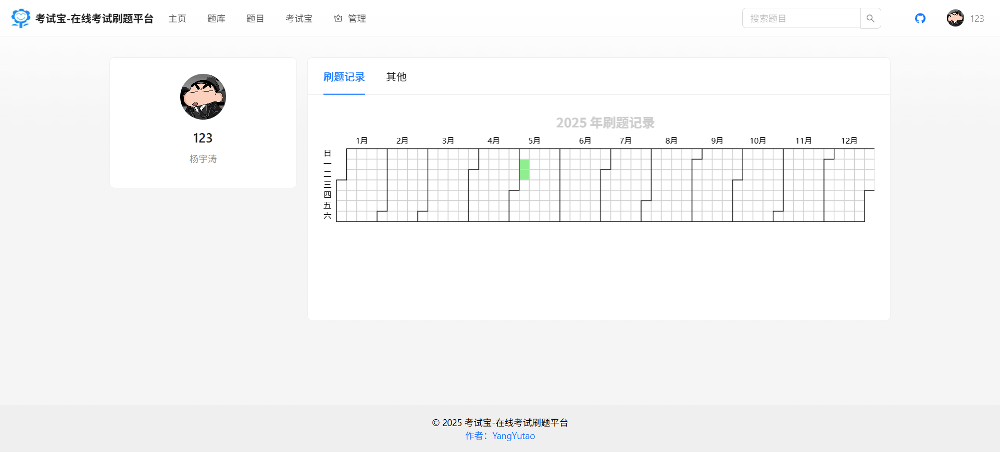

# ExamTreasure

## 1、简介

这是一个面向笔试面试的在线刷题平台，采用 React + Next.js 服务端渲染架构，结合 Ant Design 组件库和 Redux 状态管理实现。平台支持管理员创建题库、批量管理题目，提供用户在线刷题、智能搜索、刷题记录可视化等功能。项目通过 TypeScript 强类型约束和 ESLint + Prettier 代码规范保障质量，利用 OpenAPI 自动生成接口代码提升开发效率。平台具备响应式布局，支持多端访问。


## **2、技术栈**

#### 核心功能

主要技术：

- `React 18`
- `Next.js 14` 服务端渲染框架
- `pnpm` 包管理工具
- `ES Module` 模块化规范
- `sass` CSS预处理器
- `Ant Design 5.x` 组件库
- `ProComponents` 组件库
- `Redux Toolkit` 状态管理
- `TypeScript 5` 类型控制
- `Eslint` 代码规范控制
- `Prettier` 美化代码
- `Axios` 网络请求
- `OpenAPI`接口代码生成
- `ECharts`数据可视化

## 3、目录结构
- `.next`: 框架自动生成的构建输出目录
- `config`: 菜单列表配置文件
- `public`: 公共静态资源 (.ico图标)
  - `assets` 静态资源
- `src `
  - `access` 权限校验拦截器
  - `api`引入 Axios 请求库生成的请求代码
  - `app` 核心代码
    - admin 管理员的路由下的页面
      - bank 题库管理页面
      - question 题目管理页面
      - user 用户管理页面
    - bank 题库详情页
      - [questionBankId] 题库动态路由
    - banks 题库列表页面
    - question 题目详情页
      - [questionId] 题目动态路由
    - questions 题目列表页面
    - user 用户页面
      - center 用户中心页面
      - login 用户登录页面
      - register 用户注册页面
    - favicon.ico 网页logo
    - forbidden.tsx 无权限访问提示页
    - globals.css 全局css
    - index.css 主页css
    - layout.tsx 执行初始化逻辑的布局
    - page.tsx 主页
  - `components` 公用组件
    - `CollapsibleSideMenu` 可折叠的侧边导航菜单组件
    - `GlobalFooter` 全局底部组件
    - `MdEditor` Markdown富文本编辑器组件
    - `MdViewer` Markdown富文本编辑器展示组件
    - `QuestionBankList` 题库列表组件
    - `QuestionCard` 题目展示组件
    - `QuestionList` 题目列表组件
    - `QuestionTable` 题目表格组件
    - `TagList` 标签列表组件
  - `constants` 常量
  - `hooks` 钩子函数
  - `layouts` 全局通用布局
  - `libs `Axios请求拦截器
  - `stores` 全局状态
- `.eslintrc.js` 代码规范
- `.gitignore` git忽略文件
- `next.config.mjs`ES Modules 语法编写的配置文件
- `openapi.config.ts` openapi配置文件
- `package-lock.json` npm 自动生成的依赖关系锁定文件
- `package.json` 项目管理
- `tsconfig.json` TS 配置

## 4、快速开始

1. 将项目克隆到本地

   ```bash
   git clone https://github.com/YangYutao-yyt/examtreasure-frontend.git
   ```

   后端地址：https://github.com/YangYutao-yyt/examtreasure-backend

2. 进入项目目录，并分别安装前端与后端依赖

   ```bash
   cd examtreasure-frontend && npm install
   ```

3. 在 `server/src/config` 中，新建`config.js`文件夹进行项目的配置

    ```javascript
   export const redisConfig = {
     host: 'localhost',
     port: '6379',
     password: '123456',
     db: 2
   };
   export const dbConfig = {
     database: 'weirdo_terminal',
     username: 'root',
     password: '123456',
     host: 'localhost',
     port: 3306
   };
   export const baiduFanYiConfig = {
     appid: '',
     key: ''
   };
   export const gptConfig = {
     key: '',
     // baseUrl: ''
   };
   ```

4. 运行前端

   ```bash
   npm run dev
   ```

5. 访问链接： http://localhost:3000


## 5、核心功能

1. **全栈式在线刷题系统**

- 基于React+Ant Design实现多端自适应刷题界面

- 题目内容采用Markdown渲染引擎，支持代码高亮与主题定制

- 独创的刷题记录追踪Hook，结合ECharts实现可视化日历热力图

- 双渲染模式：首屏SSR保障SEO，交互式分页采用CSR优化体验

2. **工程化开发体系**

- 自主研发Next.js全栈模板，集成RBAC权限管理系统
- 通过ProLayout深度定制实现动态菜单系统，支持多级嵌套与权限过滤
- 创新性构建配置中心，集中管理路由/权限/多环境变量
- 基于OpenAPI规范的接口自动化生成体系，提升联调效率300%

3. **高性能数据管理**

- 采用Redux Toolkit原子化状态管理，实现用户会话持久化
- 智能缓存策略：静态页面增量生成+动态请求分段缓存
- 批量操作解决方案：ProTable结合虚拟滚动技术处理万级数据

4. **质量保障体系**

- TypeScript强类型约束结合自定义ESLint规则
- 请求拦截双保险：Axios实例化+全局异常监控
- 自动化构建流水线集成代码质量门禁

## 6、页面展示

主页：


题库页：


题库详情：


题目页：


登录页：


个人中心：



用户管理：


题库管理：


题目管理：


